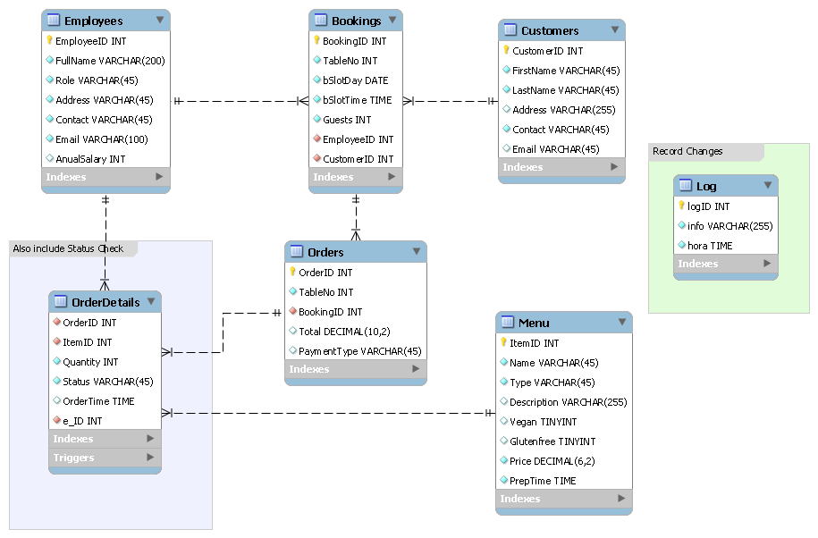
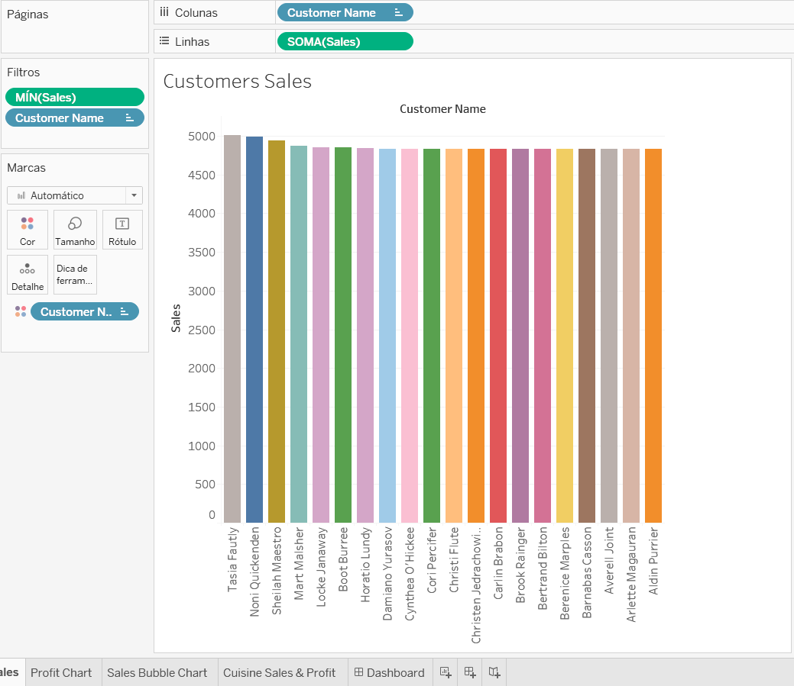
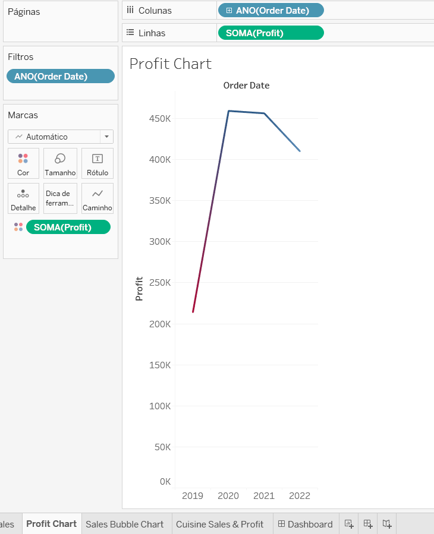
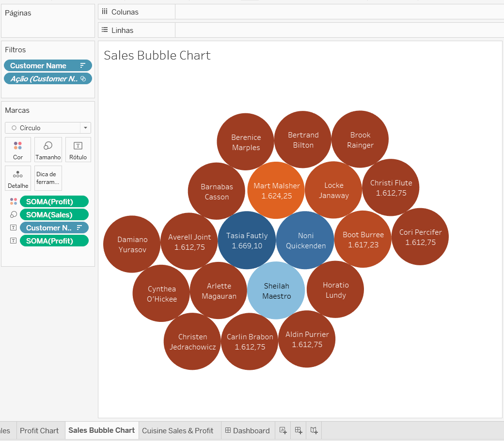
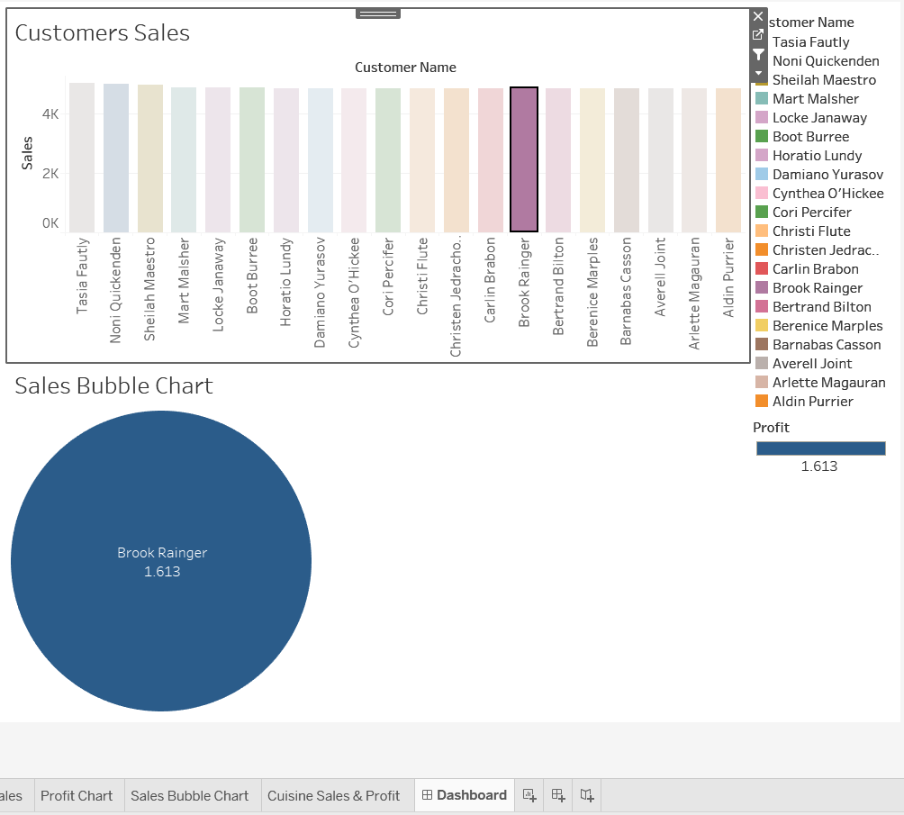

# db-capstone-project
Projeto de conclusão de curso da especialização em Engenharia de Dados

Please note that I adapted the tables to what is common practice in my country, so there is no menu and menuitems table, only the menu table as courses are not fixed, we can add anything we want from the menu.
This way there is an order table with orderitems wich contains the status of each item.

Consider this when reviewing the code.

## Entity-Relationship Diagram

To view the Entity-Relationship Diagram, click here or see the image below.



## Stored Procedures

### GetMaxQuantity()
This stored procedure retrieves the maximum quantity of a specific item that has been ordered. It's useful for inventory management.

```sql
DELIMITER // 
CREATE PROCEDURE GetMaxQuantity()
BEGIN 
    SELECT MAX(Quantity) AS MaxQuantityFromAnOrder FROM
		(SELECT SUM(od.Quantity) AS Quantity FROM OrderDetails AS od GROUP BY od.OrderID) AS Qtd;
END //
DELIMITER ;

CALL GetMaxQuantity();
```

### CheckBooking()

The CheckBooking stored procedure validates whether a table is already booked on a specified date. It will output a status message indicating whether the table is available or already booked.

```sql
DELIMITER // 
CREATE PROCEDURE CheckBooking(DateInput DATE, TableID INT)
BEGIN 
	IF EXISTS (SELECT bookingID FROM bookings WHERE (bSlotDay = DateInput) AND (TableNo = TableID)) THEN
        SELECT (CONCAT("There is already a boooking for ", DateInput, " on table ", TableID)) AS "Booking Status";
    ELSE 
		SELECT (CONCAT("There is no boooking for ", DateInput, " on table ", TableID)) AS "Booking Status";
	END IF;
END //
DELIMITER ;

CALL CheckBooking('2023-12-01', 6);
```

### UpdateBooking()

This stored procedure updates the booking details in the database. It takes the booking ID and new booking date as parameters, making sure the changes are reflected in the system.

```sql
DELIMITER // 
CREATE PROCEDURE UpdateBooking( B_ID INT, DateInput DATE, GuestsNo INT)
BEGIN 
	DECLARE updated TINYINT;
	START TRANSACTION;
    IF EXISTS (SELECT bookingID FROM bookings WHERE (B_ID = BookingID)) THEN
        UPDATE bookings SET bSlotDay = DateInput, Guests = GuestsNo WHERE BookingID = B_ID;
		SELECT (CONCAT("Booking ", B_ID, " updated")) AS "Booking Status";
        SET updated = 1;
	ELSE 
		SELECT (CONCAT("Booking ", B_ID, " not found")) AS "Booking Status";
        SET updated = 0;
	END IF;
    
    IF updated = 1 THEN COMMIT;
    ELSE ROLLBACK;
    END IF;
END //
DELIMITER ;
```

### AddBooking() 
This procedure adds a new booking to the system. It accepts multiple parameters like booking ID, customer ID, booking date, and table number to complete the process.

```sql
DELIMITER // 
CREATE PROCEDURE AddBooking(DateInput DATE, TableID INT, Customer INT)
BEGIN 
	DECLARE booked TINYINT;
	START TRANSACTION;
    IF NOT EXISTS (SELECT bookingID FROM bookings WHERE (bSlotDay = DateInput) AND (TableNo = TableID)) THEN
        INSERT INTO bookings (TableNo, bSlotDay, CustomerID)
		VALUES
		(TableID, DateInput, Customer);
		SELECT (CONCAT("Booking make for ", DateInput, " on table ", TableID)) AS "Booking Status";
        SET booked = 1;
	ELSE 
		SELECT (CONCAT("There is already a boooking for ", DateInput, " on table ", TableID)) AS "Booking Status";
        SET booked = 0;
	END IF;
    
    IF booked = 1 THEN COMMIT;
    ELSE ROLLBACK;
    END IF;
END //
DELIMITER ;

CALL AddBooking('2023-12-03', 5, 3);
```

### CancelBooking()

This stored procedure deletes a specific booking from the database, allowing for better management and freeing up resources.

```sql
DELIMITER // 
CREATE PROCEDURE CancelBooking(B_ID INT)
BEGIN 
	DECLARE deleted TINYINT;
    DECLARE customer INT;
	START TRANSACTION;
    IF EXISTS (SELECT bookingID FROM bookings WHERE (BookingID = B_ID)) THEN
		SELECT CustomerID INTO customer FROM bookings WHERE (BookingID = B_ID);
        DELETE FROM bookings WHERE BookingID = B_ID;
        INSERT INTO log (info) VALUES (CONCAT('Booking ', B_ID, ' canceled by customer ', customer));
        SELECT info from log ORDER BY hora DESC LIMIT 1;
        SET deleted = 1;
	ELSE 
		SELECT (CONCAT("Booking ", B_ID, " not found")) AS "Booking Status";
        SET deleted = 0;
	END IF;
    
    IF deleted = 1 THEN COMMIT;
    ELSE ROLLBACK;
    END IF;
END //
DELIMITER ;

CALL CancelBooking(13);
```

## Data Analysis with Tableau
A Tableau workbook has been created, containing various charts and dashboards to facilitate data analysis. Download the workbook [here](./LittleLemon.twb)









